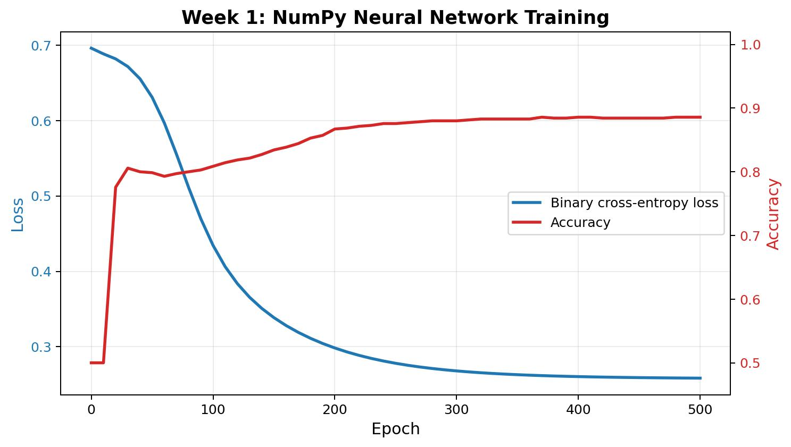
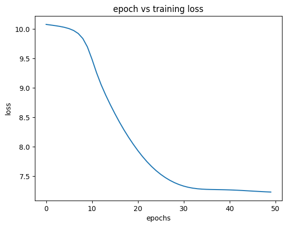
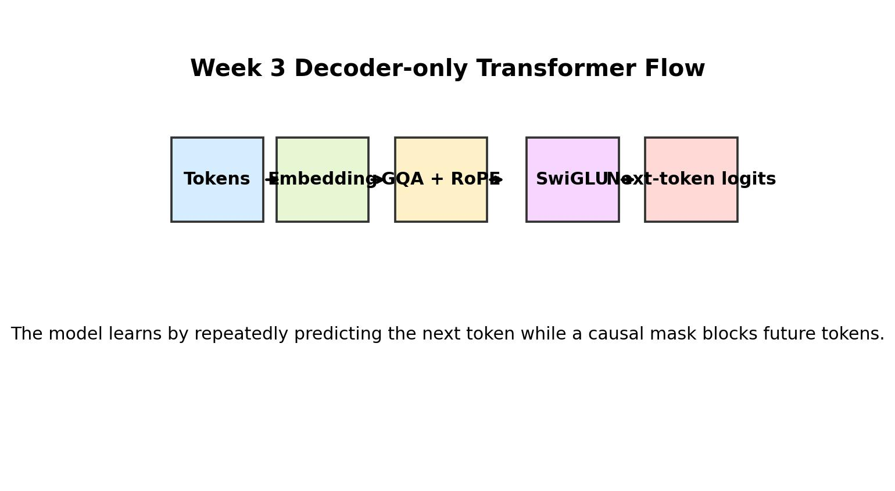
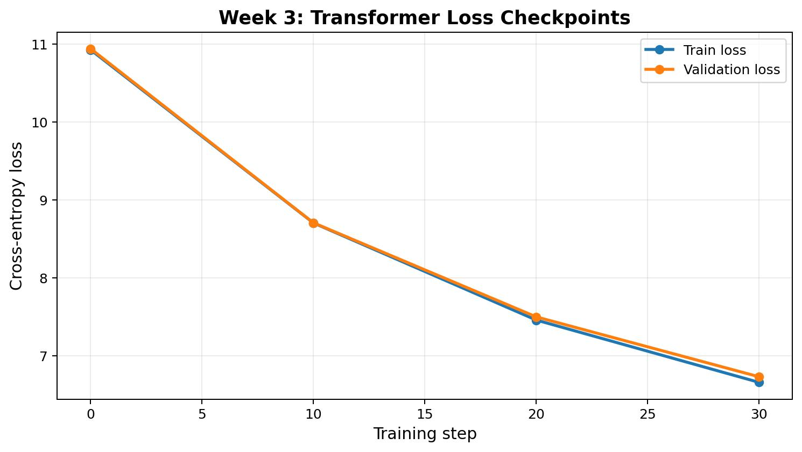
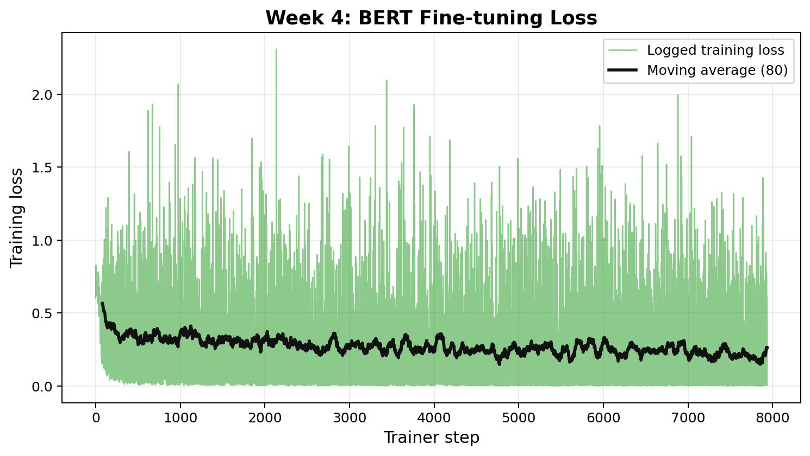
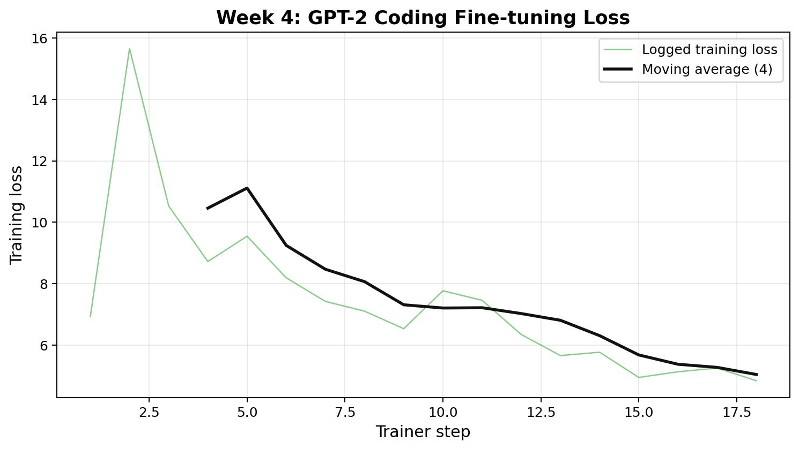

# Large Language Model CS25

## Mid-term Report

Mentee: Jithin K

Roll Number: 25B2459

Mentor: Sayandeep Haldar

Summer of Science, 2025

---

## Abstract

This mid-term report summarizes my progress in the Large Language Model CS25 project up to Week 4. The project started with the most basic question: how does a neural network actually learn? From there, I gradually moved through feed-forward neural networks, sequence models, Transformers, and finally fine-tuning pretrained language models.

The first half of the project has been less about chasing a huge final model and more about building the stack piece by piece. I implemented a small neural network from scratch using NumPy, trained an LSTM-based text generator on Shakespeare-style text, built a decoder-only Transformer in PyTorch, and then used Hugging Face tools to fine-tune BERT and GPT-2 for practical NLP tasks. This report explains the work done so far, the main ideas I learned, the issues I faced, and what I plan to improve in the second half of the project.

## 1. Introduction

Large Language Models can look almost magical from the outside. They take text, produce text, answer questions, write code, and seem to follow context over long conversations. But under the surface, they are still built from mathematical ideas that can be studied layer by layer: vectors, matrix multiplication, loss functions, gradients, attention, tokenization, and optimization.

My aim in this project is to understand that stack from the ground up. I did not want to begin directly with a ready-made model and only learn how to call an API. Instead, I wanted to first write smaller models myself, see where the difficulties actually appear, and then use modern libraries with a better sense of what they are hiding.

The progress so far follows a natural path. Week 1 focused on a simple neural network and backpropagation. Week 2 moved into sequential data using LSTMs. Week 3 was the main architectural jump into Transformers. Week 4 shifted from building architectures manually to fine-tuning pretrained models with Hugging Face. This has made the first half of the project feel like a bridge between theory and practice.

## 2. Work Completed Till Mid-term

### 2.1 Week 1: Neural Network from Scratch

The first implementation was a two-layer neural network written using Python and NumPy. I used the `make_moons` dataset from scikit-learn because it is a simple but useful non-linear binary classification problem. A linear classifier cannot solve it properly, so it is a good first test for a small neural network.

The model had one hidden layer and one output layer. I implemented the forward pass using sigmoid activations, calculated binary cross-entropy loss, and then wrote the backward pass manually. This meant deriving and coding the gradients for the weights and biases instead of letting a deep learning framework do it automatically.

The main file for this part is `Week1_perceptron.py`. It contains the `Model` class, prediction logic, training loop, accuracy calculation, and model saving/loading with `pickle`. I also wrote a separate `Testing.py` file to load the saved model and test it again on generated data.

The biggest value of this week was not the model size. It was seeing learning happen from the raw mechanics: predictions, loss, gradients, parameter updates, and then better predictions. This made backpropagation feel much less abstract.

### 2.2 Week 2: LSTM for Text Generation

After the feed-forward network, I moved to sequence modeling. The Week 2 notebook trained an LSTM on the Tiny Shakespeare dataset. The goal was to predict the next word and generate text from a starting phrase.

The data was cleaned and converted into a vocabulary. Each word was mapped to an integer index, and the integer sequence was passed through an embedding layer. I used a 64-dimensional embedding, a hidden size of 128, and a 3-layer LSTM. The LSTM output was connected to a linear layer that projected the hidden state back to the vocabulary size.

Training used cross-entropy loss and the Adam optimizer. I also plotted the loss over epochs to track whether the model was actually improving. After training, I wrote a generation function that takes a starting sequence, repeatedly predicts the next word, and appends it to the text.

This week made the idea of memory in neural networks much clearer. In a normal neural network, each input is treated almost independently. In an LSTM, the hidden state carries information forward, which is why it can model text. At the same time, I also saw why older recurrent models struggle: long sequences are difficult, gradients are delicate, and training can become messy quickly.

### 2.3 Week 3: Decoder-only Transformer

Week 3 was the largest jump in complexity. I implemented a decoder-only Transformer in PyTorch, inspired by GPT-style language models. This was the first time the project started to look like a real miniature LLM.

The implementation is in `Week3_work/transformer_model.py`. I used the GPT-2 tokenizer through `tiktoken`, which gave the model a vocabulary of 50,257 tokens. The model used a block size of 256, 6 Transformer layers, an embedding dimension of 384, 6 attention heads, and 2 key-value heads for grouped-query attention.

The important components I implemented were:

- causal self-attention, so the model can only look at previous tokens;
- grouped-query attention, which shares key-value heads across multiple query heads;
- rotary positional embeddings, which encode token position through rotation;
- RMSNorm for normalization;
- SwiGLU feed-forward layers;
- a generation function for sampling new tokens from the trained model.

This week changed my understanding of language models the most. The LSTM tries to carry memory forward step by step, but the Transformer lets tokens attend to other tokens directly. That makes long-range relationships much easier to model and also makes the architecture much more parallelizable.

The model was trained with AdamW and cross-entropy loss. After training, I used the generation function to sample text from a blank starting context. The output was still small-scale and experimental, but the architecture itself connected directly to how GPT-like models are built.

### 2.4 Week 4: Fine-tuning Pretrained Models

In Week 4, I moved from building models from scratch to using pretrained models. This was an important shift because modern NLP work often depends on adapting large pretrained checkpoints rather than training everything from zero.

I worked on two notebooks. In `Copy of Fine_tune.ipynb`, I fine-tuned `bert-base-uncased` for binary sentiment classification using the SST-2 dataset from Hugging Face datasets. I used `AutoModelForSequenceClassification` with two labels, tokenized the sentences with the BERT tokenizer, and used `Trainer`, `TrainingArguments`, and `DataCollatorWithPadding` for the training pipeline. The trained model was saved as `final_bert_sentiment_model`.

In `Copy of GPT2.ipynb`, I fine-tuned GPT-2 as a causal language model on MBPP programming examples. Each sample was formatted as a problem statement followed by a solution. This turned the dataset into a next-token prediction task where the model learns code-style completions. I used `AutoModelForCausalLM`, the GPT-2 tokenizer, `DataCollatorForLanguageModeling` with `mlm=False`, and the Hugging Face `Trainer`. The final model was saved as `final_gpt2_coding_model`.

The main lesson here was that fine-tuning has its own difficulties. Even when the model architecture is already available, the details still matter: tokenization, truncation, padding side, labels, collators, optimizer settings, batch size, and saving checkpoints. It felt like moving one level higher in the stack. Instead of manually deriving gradients, I had to think more carefully about the training pipeline.

## 3. Technical Summary

So far, the project has covered four levels of model-building:

- a NumPy neural network for binary classification;
- a PyTorch LSTM for next-word prediction;
- a PyTorch decoder-only Transformer for token generation;
- Hugging Face fine-tuning workflows for BERT and GPT-2.

This progression has helped me connect the older and newer ideas in NLP. The first model taught me how parameters are updated. The LSTM showed me why memory matters in language. The Transformer showed me why attention became the central idea in modern LLMs. Fine-tuning showed me how pretrained models are adapted to real tasks.

Another important part of the project has been learning the tooling around models. In the beginning I mostly used NumPy and scikit-learn. Then I moved to PyTorch for automatic differentiation, tensor operations, GPU support, and model modules. Finally, I used Hugging Face Transformers and Datasets, which made it possible to load pretrained checkpoints and datasets quickly.

## 4. Challenges Faced

The first challenge was mathematical. Backpropagation looks clean on paper, but implementing it manually forces every shape and derivative to be correct. A small mistake in a transpose or gradient formula can stop the model from learning.

The second challenge was sequence modeling. In the LSTM notebook, data preparation mattered more than I expected. Cleaning the text, building the vocabulary, converting words into indices, and matching input-target pairs were all necessary before the model could even start learning.

The Transformer implementation was the hardest part technically. Causal masking, attention shapes, grouped-query attention, RoPE, and residual connections all had to work together. It was very easy to get a tensor shape wrong. Debugging this made me appreciate why frameworks and tested implementations are so valuable.

Fine-tuning introduced a different kind of challenge. The code looked shorter, but the decisions became more practical: which collator to use, how to handle padding, what learning rate is reasonable, and how to format the dataset so that the model learns the intended task. This was a good reminder that using a pretrained model is not the same as skipping the work.

## 5. Learnings and Reflections

The most important learning so far is that LLMs are not one single idea. They are a stack of ideas that support each other. A model needs a way to represent tokens, a way to mix information, a training objective, a data pipeline, an optimizer, and a generation method. If one part is weak or mismatched, the whole system suffers.

I also learned that building from scratch and using libraries are both useful, but for different reasons. Building from scratch gives intuition. It makes concepts like gradients, hidden states, and attention feel real. Using libraries teaches the practical workflow used in modern machine learning. The project has been valuable because it forced me to do both.

Another personal takeaway is that the jump from understanding a concept to implementing it is bigger than it looks. I had read about Transformers before, but writing the classes, tracking tensor dimensions, and training the model made the architecture much more concrete.

At this stage, I would not call the project a finished LLM system yet. But I do feel that the foundation is much stronger now. I can look at a modern language model pipeline and recognize the pieces instead of seeing it as one black box.

## 6. Plan for the Second Half

For the next half of the project, I want to make the work more complete and measurable. The first goal is to improve evaluation. For Week 1 and Week 4 especially, I want clearer validation metrics instead of only training outputs. For the text generation models, I want to compare generated samples more carefully and track loss curves in a cleaner way.

I also want to clean and organize the notebooks and scripts so that the project can be rerun more easily. Some parts were written while experimenting, so they can be made more readable and reproducible.

On the modeling side, I want to explore parameter-efficient fine-tuning methods such as LoRA and possibly quantization. These are important because large models cannot always be fully fine-tuned on limited hardware. If time permits, I would also like to build a small retrieval-augmented generation pipeline, because it connects LLMs with external knowledge instead of relying only on model weights.

Finally, I want the final report to connect the whole journey clearly: from a small neural network to LSTMs, Transformers, pretrained models, and modern adaptation techniques. The aim is not just to show that code was written, but to show that the ideas behind the code became clearer.

## 7. References and Resources

- Week 1 implementation: `Week1_work/Week1_perceptron.py`
- Week 1 testing script: `Week1_work/Testing.py`
- Week 2 notebook: `Week2_work/Copy_of_Character_level_LSTM_model.ipynb`
- Week 3 implementation: `Week3_work/transformer_model.py`
- Week 4 BERT fine-tuning notebook: `Week4_work/Copy of Fine_tune.ipynb`
- Week 4 GPT-2 fine-tuning notebook: `Week4_work/Copy of GPT2.ipynb`
- Hugging Face Transformers and Datasets documentation
- Andrej Karpathy's GPT and neural network learning resources
- The original Transformer paper, "Attention Is All You Need"
